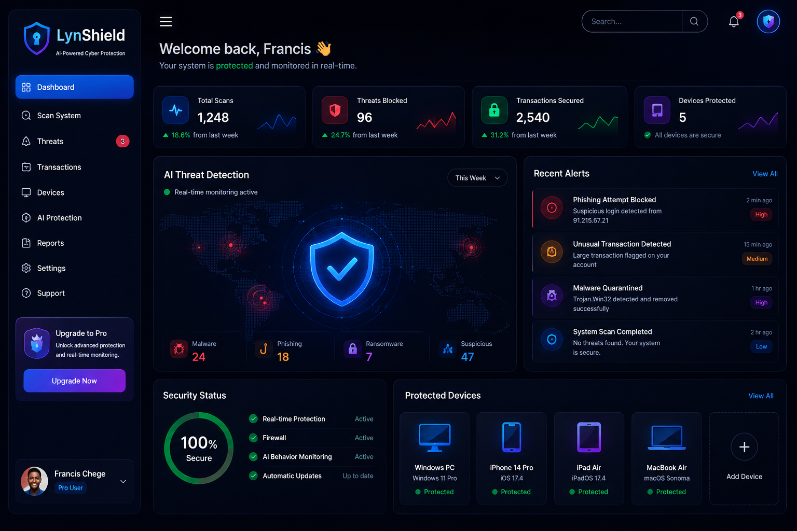
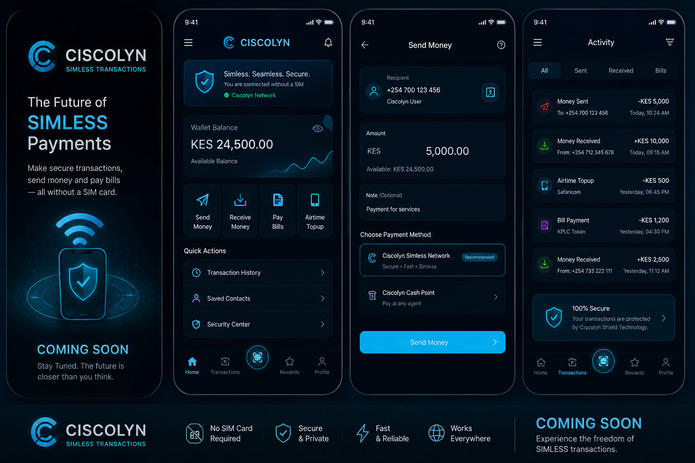

# 🚀 Nexora Hub

Nexora Hub is a modern technology portfolio and software solutions website showcasing innovative digital products, web development services, mobile applications, and future-ready tech projects.

## 🌟 Features

- Responsive modern design
- Animated hero section
- Interactive project showcase
- Technology services section
- Contact form
- WhatsApp integration
- Smooth scrolling navigation
- Mobile-friendly layout

## 🛠️ Technologies Used

- HTML5
- CSS3
- JavaScript
- Font Awesome
- Google Fonts

## 📂 Featured Projects

### 🔐 LynShield
An AI-powered anti-fraud and cybersecurity platform designed to protect users from digital scams and suspicious activities.

### 💳 Ciscolyn
A revolutionary fintech concept enabling transactions through secure device identification technology.

### 🌐 Nexora Cloud
Cloud infrastructure and hosting solutions for modern businesses.

## 📱 Contact

**Founder:** Francis Chege

**WhatsApp:** +254 790 357 975

**Location:** Kamakis, Ruiru, Kenya

## 🚀 Live Demo

https://Francis297-web.github.io/nexora-hub/

## 📸 Screenshots

```markdown





